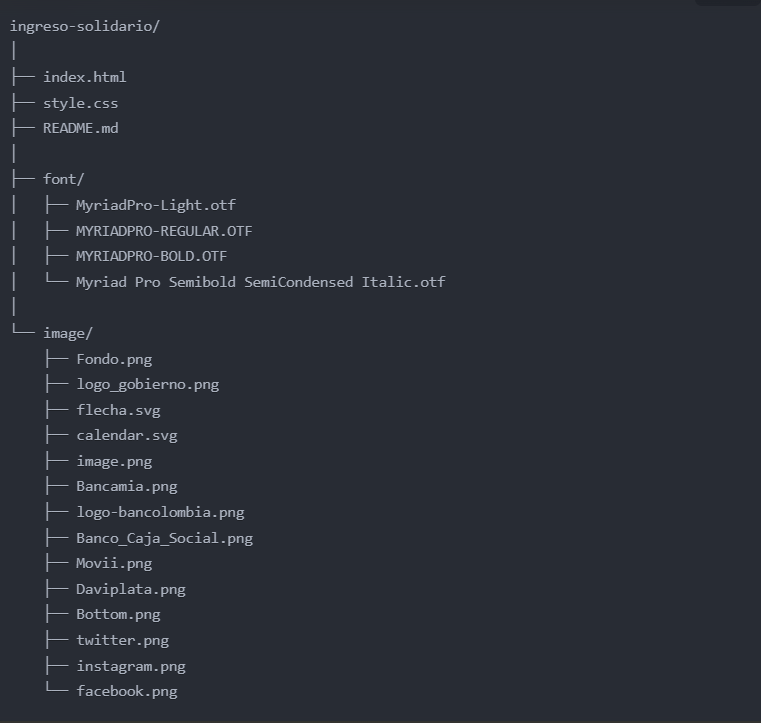

# Ingreso Solidario

## Descripción

Este repositorio contiene el código fuente para una página web informativa sobre el programa de Ingreso Solidario, una ayuda económica del gobierno colombiano para familias afectadas por la pandemia de COVID-19.

 ## Secciones Principales

La página web consta de cuatro secciones principales:

|Sección | Descripción   |
|--|--|
|**Consulta**|Incluye un formulario para que los usuarios verifiquen su estado en el programa y una breve introducción al Ingreso Solidario.|
|**¿Qué es?**|Explica en detalle qué es el Ingreso Solidario y quiénes pueden beneficiarse.|
|**Entrega**|Detalla las etapas de entrega del subsidio y los bancos autorizados para la distribución.|
|**Preguntas Frecuentes**|Una sección destinada a responder las dudas comunes de los usuarios.|

La página incluye un encabezado fijo con el logotipo del gobierno y una barra de navegación que permite acceder a las diferentes secciones.

## Tecnologías utilizadas

- HTML5
- CSS3
- Fuentes personalizadas (Myriad Pro Light, Myriad Pro Regular, Myriad Pro Bold)

## Estructura del proyecto

| Carpetas o Archivos |Contenido|
|--|--|
|`font/`|contiene las fuentes personalizadas utilizadas en el proyecto.|
|`image/`|contiene las fuentes personalizadas utilizadas en el proyecto.|
|`index.html`|es el archivo principal de la página web.|
|`style.css`|contiene los estilos CSS para darle formato a la página web.|
|`README.md`|es este archivo que proporciona información sobre el proyecto.|

## Características del diseño

- Diseño responsivo utilizando unidades vw (viewport width) para la mayoría de las dimensiones.
- Posicionamiento absoluto para la mayoría de los elementos.
- Efectos de diseño personalizados, como flechas para los selectores y el calendario.
- Barra de navegación fija en la parte superior.
- Uso de imágenes de fondo y logotipos de bancos autorizados.

## Instrucciones de uso

1. Clona este repositorio o descarga los archivos en tu máquina local.
2. Abre el archivo `index.html` en un navegador web compatible.
3. Navegación: Utiliza la barra de navegación fija en la parte superior para moverte entre las diferentes secciones de la página (Consulta, ¿Qué es?, Entrega, Preguntas Frecuentes).
4. Consulta de estado: En la sección "Consulta", utiliza el formulario proporcionado para verificar tu estado en el programa Ingreso Solidario. Asegúrate de ingresar la información correcta.
5. Información detallada: Lee cuidadosamente la sección "¿Qué es?" para entender completamente el programa Ingreso Solidario y sus beneficiarios.
6. Proceso de entrega: Revisa la sección "Entrega" para conocer las etapas de distribución del subsidio y los bancos autorizados para realizar los pagos.
7. Resolución de dudas: Si tienes preguntas, consulta la sección "Preguntas Frecuentes" donde encontrarás respuestas a las dudas más comunes.

## Explicación de uso

Esta página web está diseñada para proporcionar información completa y accesible sobre el programa Ingreso Solidario del gobierno colombiano. Su estructura y diseño permiten una navegación intuitiva y una presentación clara de la información.

El diseño responsivo, que utiliza unidades vw, asegura que la página se vea bien en diferentes tamaños de pantalla. Los elementos están posicionados de manera absoluta para mantener una disposición coherente en todos los dispositivos.

La barra de navegación fija facilita el acceso rápido a todas las secciones de la página, mejorando la experiencia del usuario. Los efectos de diseño personalizados, como las flechas para los selectores y el calendario, añaden elementos interactivos que mejoran la usabilidad.

El uso de fuentes personalizadas (Myriad Pro) y las imágenes de fondo contribuyen a una estética profesional y coherente con la imagen del gobierno.

Para los desarrolladores o diseñadores que quieran modificar o adaptar este proyecto, la estructura de carpetas organizada (font/, image/) y los archivos principales (index.html, style.css) facilitan la localización y edición de los diferentes componentes del sitio.

En resumen, esta página web ofrece una plataforma informativa completa y bien diseñada para que los ciudadanos colombianos puedan acceder fácilmente a la información sobre el programa Ingreso Solidario.

## Créditos

Este proyecto fue desarrollado por Jaime Enrique Barrera Sandoval como parte de un refuerzo para practicar y reforzar conceptos vistos en HTML y CSS.
